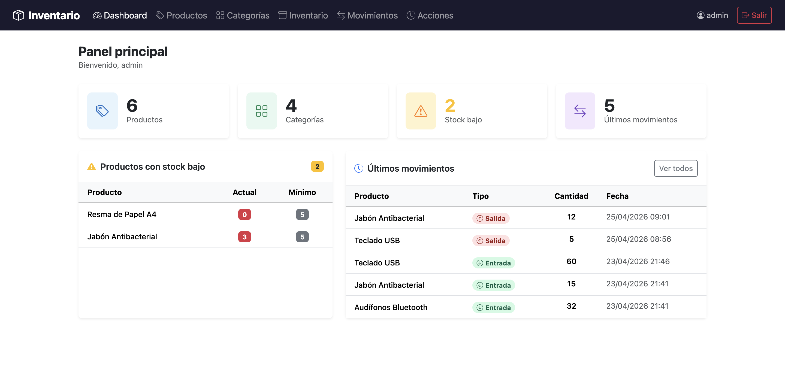
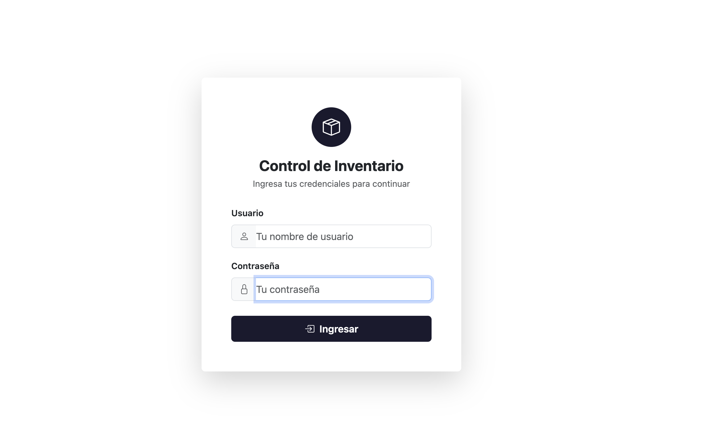
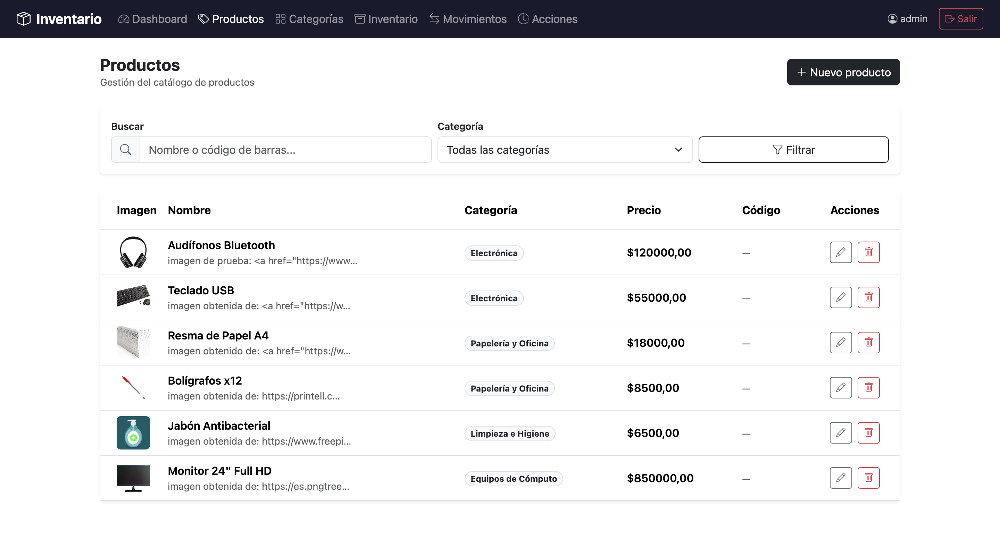
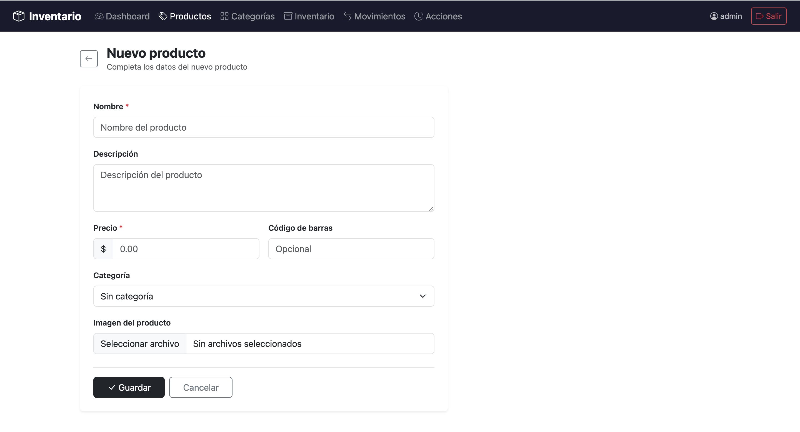
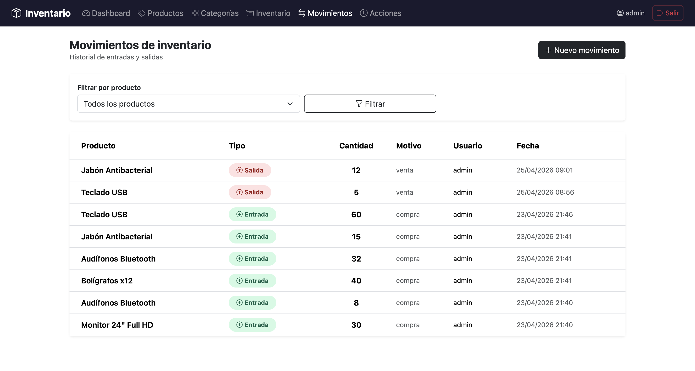
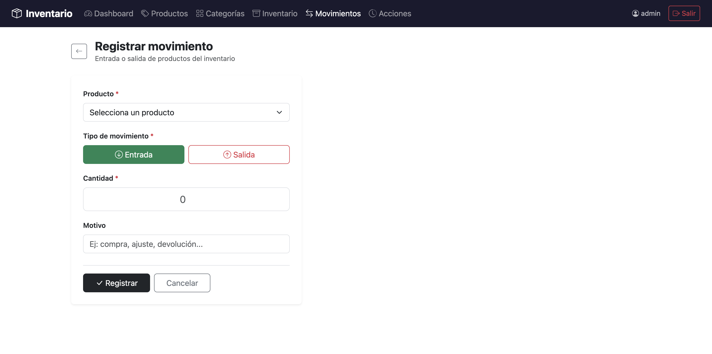

## Sistema de Control de Inventario

Sistema web de gestión de inventario desarrollado con Django, orientado a pequeñas y medianas empresas que necesitan rastrear productos, movimientos de stock y acciones de usuario en tiempo real.

# Demo & Capturas

### Dashboard

### login

### Productos

### nuevo Producto

### Movimientos

### Registro movimiento

Funcionalidades Principales
•	Autenticación segura: Login/logout con registro de acciones del usuario
•	Dashboard: Vista general con métricas clave, alertas de bajo stock y movimientos recientes
•	Gestión de Productos (CRUD): Crear, leer, actualizar y eliminar productos con soporte para imágenes, código de barras, precio y categoría
•	Gestión de Categorías (CRUD): Organización flexible de productos por categorías
•	Seguimiento de Inventario en Tiempo Real: Monitoreo de niveles de stock con umbrales mínimos configurables
•	Registro de Movimientos: Control de entradas y salidas de stock con validación para evitar existencias negativas
•	Registro de Acciones: Auditoría detallada de todas las operaciones realizadas por los usuarios
•	Panel de Administración Django: Gestión avanzada de datos a través del admin integrado.

# Tecnologías Utilizadas

Capa	Tecnología
Backend	Python · Django
Base de Datos	SQLite (desarrollo)
Frontend	HTML · CSS · JavaScript · Django Templates
Imágenes	Pillow
Control de Versiones	Git

Estructura del Proyecto
inventario-project/
├── manage.py                  # CLI de administración Django
├── requirements.txt           # Dependencias del proyecto
├── README.md
├── LICENSE
│
├── config/                    # Configuración principal del proyecto
│   ├── settings.py            # Configuración global (BD, idioma es-co, zona America/Bogota)
│   ├── urls.py                # Enrutador principal de URLs
│   ├── wsgi.py
│   └── asgi.py
│
├── inventario/                # Aplicación principal
│   ├── models.py              # Modelos: Categoria, Producto, Inventario, Movimiento, RegistroAccion
│   ├── views.py               # Lógica de negocio y manejo de solicitudes
│   ├── urls.py                # URLs de la aplicación
│   ├── admin.py               # Configuración del panel administrativo
│   ├── signals.py             # Señales: actualización automática de stock post-movimiento
│   ├── apps.py                # Configuración de la app
│   ├── tests.py               # Pruebas unitarias
│   └── migrations/            # Migraciones de base de datos
│
├── templates/inventario/      # Plantillas HTML
│   ├── login.html
│   ├── dashboard.html
│   ├── producto_form.html
│   ├── inventario.html
│   ├── movimientos.html
│   └── acciones.html
│
├── static/                    # Archivos estáticos
│   ├── css/estilos.css
│   └── js/
│
└── media/productos/           # Imágenes subidas por usuarios

# Instalación y Configuración

Prerrequisitos
•	Python 3.8+
•	pip
•	Git

# Pasos
1.	Clona el repositorio
bash
git clone https://github.com/tu-usuario/inventario-project.git
cd inventario-project
2.	Crea y activa el entorno virtual
bash
python -m venv venv

# Windows
venv\Scripts\activate

# Linux / macOS
source venv/bin/activate
3.	Instala las dependencias
bash
pip install -r requirements.txt
4.	Aplica las migraciones
bash
python manage.py migrate
5.	Crea un superusuario
bash
python manage.py createsuperuser
6.	Inicia el servidor de desarrollo
bash
python manage.py runserver
7.	Accede a la aplicación
•	App principal: http://127.0.0.1:8000
•	Panel de administración: http://127.0.0.1:8000/admin

# Modelos de Datos
Modelo	Descripción
Categoria	Clasificación de productos
Producto	Información del producto (nombre, precio, imagen, código de barras)
Inventario	Stock actual y umbral mínimo por producto
MovimientoInventario	Registro de entradas y salidas de stock
RegistroAccion	Auditoría de acciones realizadas por usuarios
Las señales Django (signals.py) actualizan automáticamente el inventario cada vez que se registra un movimiento.

# Pruebas
bash
python manage.py test inventario

# Variables de Configuración Relevantes
En config/settings.py:
python
LANGUAGE_CODE = 'es-co'
TIME_ZONE = 'America/Bogota'
Para producción, recuerda cambiar DEBUG = False y configurar una base de datos más robusta como PostgreSQL.

# Contribuciones
Las contribuciones son bienvenidas. Por favor abre un issue primero para discutir los cambios que deseas realizar.
1.	Haz fork del repositorio
2.	Crea una rama: git checkout -b feature/nueva-funcionalidad
3.	Realiza tus cambios y haz commit: git commit -m 'feat: agrega nueva funcionalidad'
4.	Haz push a tu rama: git push origin feature/nueva-funcionalidad
5.	Abre un Pull Request

# Licencia
Este proyecto está bajo la licencia incluida en el archivo LICENSE.

# Autor
Joan Manuel Flórez
Desarrollador de Software
Bogotá, Colombia

